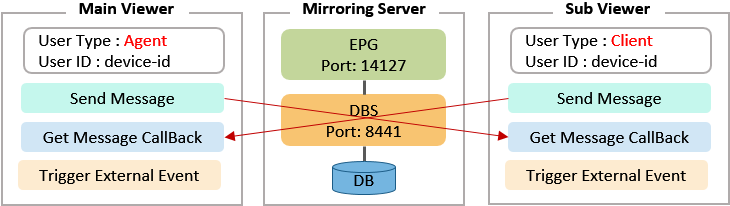

# Features

## Desktop main viewer

| Mode | Feature |
| :--- | :--- |
| Hand | Input data is synchronized to mobile viewer. |
| Comment | Comment \(pen or highlighter\) is synchronized to mobile viewer. |
| Guide | Focusing on a component on desktop viewer moves pages on mobile to show the component and highlight the component. |

## Mobile sub viewer

Input data on mobile viewer is synchronized to desktop viewer.

## How It Works

* Mirroring server consists of EPG \(Event Push Gateway\) and DBS \(Database Server\). 
* Mirroring server do synchronization between main and sub viewer.
* Value and focus events are exchanged by messages.
* Each viewers get events and trigger onExternalEvent of the e-Form to synchronize events. 
* Main Viewer with OZ server and Mirroring server can be run on the sample server or can be separated.

