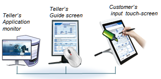
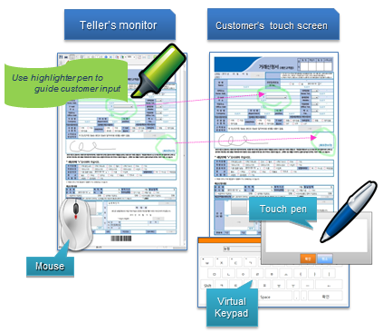

# Multi-Screen Viewer

## Overview

The OZ Multi-Screen Viewer is a key solution for paperless face-to-face customer service. For example, the bank teller can monitor customer’s data input on the form in real-time and guide customer to enter data correctly.

## Features

1. Synchronize forms between the desktop monitor and touch screen monitor. 
2. The customer can enter data on the customer screen and the teller can put annotation on the guide screen concurrently.
3. The teller can make markers with highlighter pen on the guide screen to guide customer input and the customer can see highlighted marks on the customer screen in real-time. 
4. Provides a virtual keypad for text input on the customer’s touch screen 
5. Real-time screen synchronization between customer and guide screen.
6. When the customer puts data on a field, the teller can see the field highlighted on the guide screen.

## Modes

### Input mode

1. Input mode is the default mode and if you are in different mode you can switch back to input mode by clicking the input mode icon on the desktop viewer. 
2. The desktop user and the tablet user can independently enter data in different fields on their own forms.

### Comment mode

1. Comment mode is started by clicking the comment mode icon on the desktop viewer menu bar. 
2. If the desktop user selects fields that should be filled by the tablet user, the corresponding fields on the tablet will be automatically highlighted to notify the tablet user.

### Guide mode

1. Guide mode is started by selecting the Guide mode icon on the desktop viewer menu bar. 
2. If the desktop user selects a field that should be filled by the tablet user, the corresponding field on the tablet will be automatically highlighted and the keypad will open to guide the tablet user to enter data

